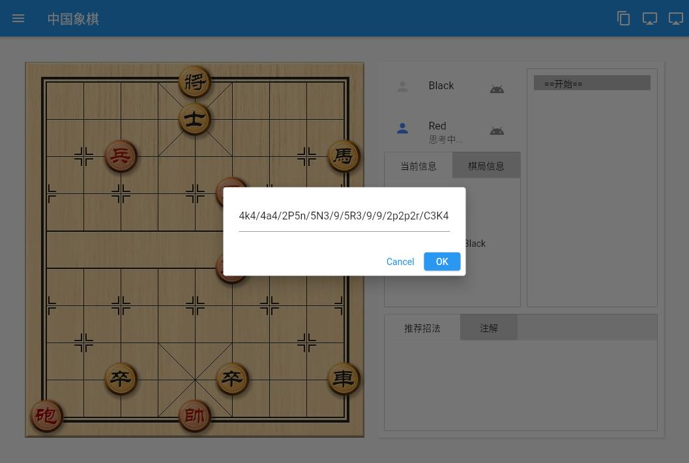
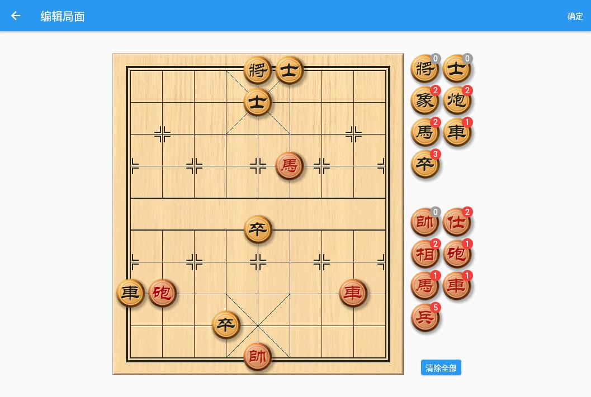
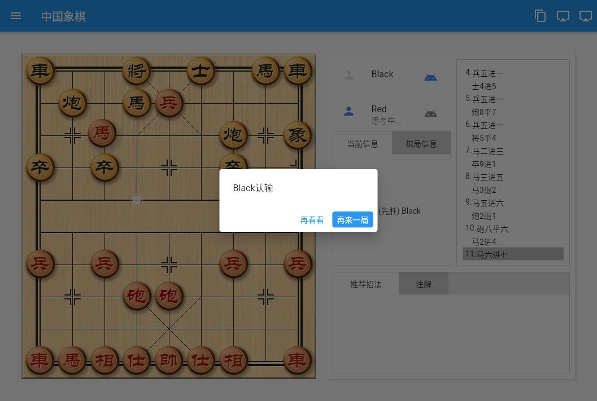

# Chinese Chess

中国象棋界面端. 提供完整的游戏规则处理，windows版带[elephanteye](https://www.xqbase.com/league/elephanteye.htm)引擎的招法提示 

## 功能

- [x] 游戏规则处理。包括落子点提示，将军、应将提示，输赢检测
- [x] 棋盘棋子皮肤加载
- [x] 支持PGN格式加载，FEN格式导入
- [x] PGN格式导出, FEN格式局面复制
- [ ] 棋谱自动演播
- [x] 多语言支持
- [x] 加入音效(暂时不支持windows和linux)
- [x] 对局信息展示
- [x] 编辑局面
- [x] 加入随机落着的笨机器人(内置机器人已更新为象棋小巫师)
- [ ] 局面时间控制
- [ ] 在线对局

## 界面
- [ ] 版面美化
- [x] Windows版适配
- [x] Web版适配
- [x] Android版适配
- [ ] IOS版适配
- [x] MacOS版适配
- [ ] Linux版适配

## 已知问题

* [优化中]web版使用内置的随机落着机器人，仅供娱乐 
    * 开局棋谱查询落着
    * 中局及残局增加招法深度
    * 招法权重算法优化
* [已解决]某些情况下不能正确判断结束
* [已解决]windows版使用elephanteye，如果有打开的ele窗口，缩小它就行了
* [已解决]windows版机器人和用户提示共用一个引擎，偶有出招冲突

## 预览
棋盘界面和棋子取自象棋小巫师的资源 
[Web版在线预览](https://www.shirne.com/demo/chinesechess/) web版需要加载canvaskit，打开较慢
|将军|Web机器人|
|:---:|:---:|
|||
|粘贴局面代码|棋谱查看|
|||
|编辑局面|结果|
|||

## 使用Flutter开发

This project is a starting point for a Flutter application.

A few resources to get you started if this is your first Flutter project:

- [Lab: Write your first Flutter app](https://flutter.dev/docs/get-started/codelab)
- [Cookbook: Useful Flutter samples](https://flutter.dev/docs/cookbook)

For help getting started with Flutter, view our
[online documentation](https://flutter.dev/docs), which offers tutorials,
samples, guidance on mobile development, and a full API reference.

## 参考文献
* [ECCO]https://www.xqbase.com/ecco/ecco_contents.htm#ecco_a
* [UCCI]https://www.xqbase.com/protocol/cchess_ucci.htm
* [着法表示]https://www.xqbase.com/protocol/cchess_move.htm
* [FEN格式]https://www.xqbase.com/protocol/cchess_fen.htm
* [PGN格式]https://www.xqbase.com/protocol/cchess_pgn.htm

## Log

* 20210509 设置页，功能优化，内置机器人由[象棋小巫师](https://github.com/xqbase/eleeye)翻译而来

* 20210504 编辑局面功能，多处细节优化

* 20210430 结果提示，棋谱加载 困毙判断

* 20210429 布局重构，走子算法改进；皮肤加载；将军及应将、送将判断

* 20210426 走子规则 走子动画
* 20210425 完成界面，走棋，吃子