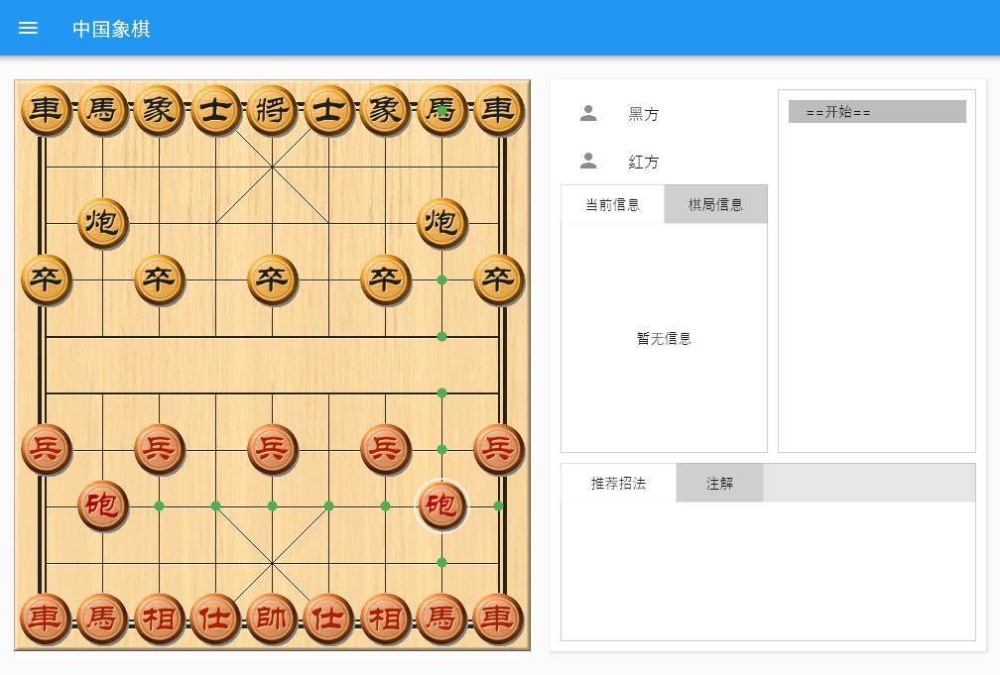
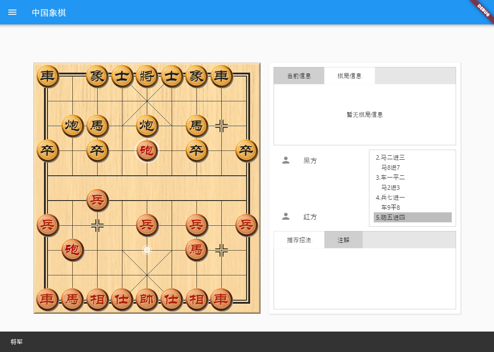
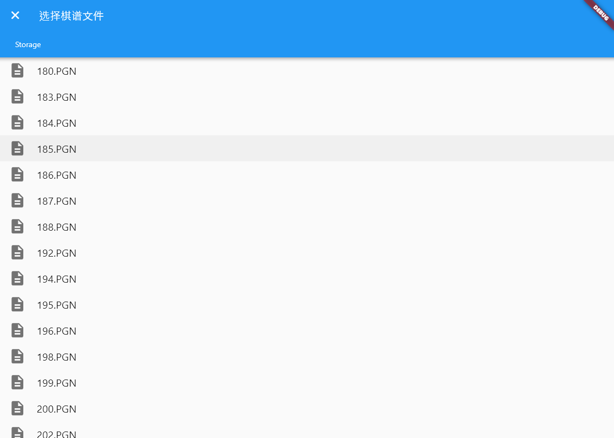
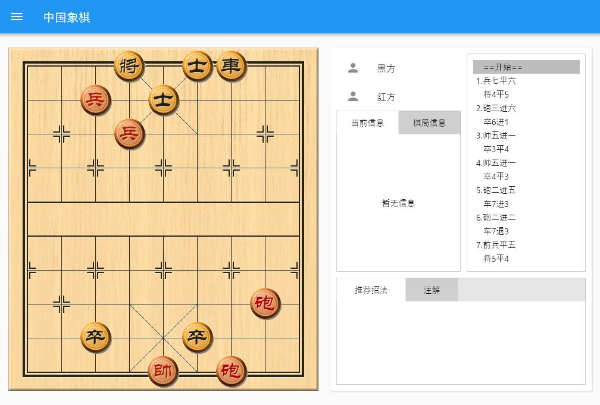

# Chinese Chess

中国象棋界面端. 提供完整的游戏规则处理，windows版带[elephanteye](https://www.xqbase.com/league/elephanteye.htm)引擎的招法提示 

## 功能

- [x] 游戏规则处理。包括落子点提示，将军、应将提示，输赢检测
- [x] 棋盘棋子皮肤加载
- [x] 支持PGN格式加载，FEN格式导入
- [ ] PGN格式导出, FEN格式局面复制
- [ ] 棋谱自动演播
- [ ] 多语言支持
- [ ] 加入音效
- [ ] 对局信息展示
- [ ] 编辑局面
- [ ] 加入随机落着的笨机器人
- [ ] 局面时间控制

## 界面
- [ ] 版面美化(求免费美工，本项目目前没有任何赢利)
- [x] Windows版适配
- [x] Web版适配
- [ ] Android版适配
- [ ] IOS版适配
- [ ] MacOS版适配
- [ ] Linux版适配

## 预览
棋盘界面和棋子取自象棋小巫师的资源 
[Web版在线预览](https://www.shirne.com/demo/chinesechess/) web版需要加载canvaskit，打开较慢
|开局|将军|
|:---:|:---:|
|||
|加载|棋谱查看|
|||

## 使用Flutter开发

This project is a starting point for a Flutter application.

A few resources to get you started if this is your first Flutter project:

- [Lab: Write your first Flutter app](https://flutter.dev/docs/get-started/codelab)
- [Cookbook: Useful Flutter samples](https://flutter.dev/docs/cookbook)

For help getting started with Flutter, view our
[online documentation](https://flutter.dev/docs), which offers tutorials,
samples, guidance on mobile development, and a full API reference.

## 参考文献
* [UCCI]https://www.xqbase.com/protocol/cchess_ucci.htm
* [着法表示]https://www.xqbase.com/protocol/cchess_move.htm
* [FEN格式]https://www.xqbase.com/protocol/cchess_fen.htm
* [PGN格式]https://www.xqbase.com/protocol/cchess_pgn.htm

## Log

* 20210430 结果提示，棋谱加载 困毙判断

* 20210429 布局重构，走子算法改进；皮肤加载；将军及应将、送将判断

* 20210426 走子规则 走子动画
* 20210425 完成界面，走棋，吃子